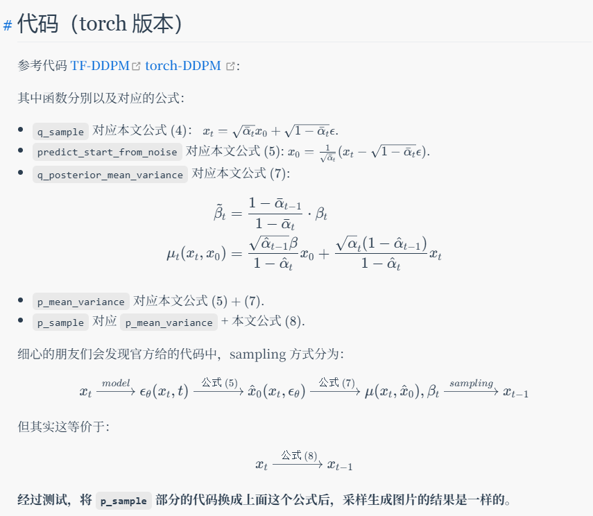

<!-- Not Pure Poole supports [MathJax](https://www.mathjax.org/). You can enable it on a page by setting `math: true` in the front matter.

An inline math: \\\(E=mc^2\\\).

A display math:

$$
i\hbar \frac{\partial \Psi}{\partial t} = -\frac{\hbar^2}{2m}
\frac{\partial^2 \Psi}{\partial x^2} + V \Psi
$$ -->
# Diffusion Models 数学原理的推导 -- DDPM
基本思想：

## Problem Formulation
Given dataset $X$ (n images), train an generative model that generative images.

## Forward diffusion
$x_T \leftarrow x_{T-1} \leftarrow x_{T-2} \leftarrow \dots \leftarrow x_0$

For an image $x_0$, destroy the image through gradually add noise $\epsilon \sim \mathcal{N}(0,I)$. 其中系数time t的加噪系数为$\beta_t$：

$$x_t = \sqrt{1 - \beta_t} x_{t-1} + \sqrt{\beta_t} \epsilon_{t - 1} \tag{1.1}$$

> 具体实现中，这个 $\epsilon_{t-1}$ 是每一个timestep中从 $\mathcal{N}(0,I)$ sample出来的多维vector。

则有 $q(x_t | x_{t - 1}) \sim \mathcal{N}(\sqrt{1 - \beta_t} x_{t-1}, \beta_t I)$。记 $\alpha_t=1 - \beta_t$，则有：

$$x_t = \sqrt{\alpha_t} x_{t-1} + \sqrt{1 - \alpha_t} \epsilon_{t - 1}$$
$$= \sqrt{\alpha_t} (\sqrt{\alpha_{t-1}} x_{t - 2} + \sqrt{1 - \alpha_{t-1}} \epsilon_{t-2} ) + \sqrt{1 - \alpha_t} \epsilon_{t - 2}$$

其中两个独立的 $\epsilon$ 相加有公式，记 $\overline{\alpha_t}=\Pi_{i=1}^{t}$，则有：

$$x_t = \sqrt{\alpha_t \alpha_{t-1}} x_{t-2} + \sqrt{1 - \alpha_t \alpha_{t-1}} \epsilon_{t - 2}$$
$$= \sqrt{\overline{\alpha_t}} x_{0} + \sqrt{1 - \overline{\alpha_t}} \epsilon_t \tag{1.2}$$

从上式可以看到，当 $T$ 足够大时，$x_T \sim \mathcal{N}(0, I)$，则可以得到destroy后的图片。至此，forward diffusion完成。

**注意1.1与1.2中的 $\epsilon_t$ 还不太一样**

## Reverse diffusion
我们需要为整个数据集学习一个模型 $\theta$，能够handle这个逆向扩散过程，即拟合 $p(x_{t-1}|x_{t})$。

$x_T \rightarrow x_{T-1} \rightarrow x_{T-2} \rightarrow \dots \rightarrow x_0$

### Preliminary 推导

首先有后验: $p(x_{1:T} | x_0) = \Pi_{t=1}^{T} p(x_t|x_{t-1})$。$p(x_{t-1}|x_t)$在 $\beta_t$很小的时候貌似是高斯 ?比较难求

所以我们看 $q(x_{t-1} | x_t, x_0)$，given $x_0$ 的情况下，这是个高斯分布，也可以从运算角度看：

$$q(x_{t-1} | x_t, x_0) = \frac{q(x_{t - 1}, x_t | x_0)}{q(x_t | x_0)} = \frac{q(x_{t - 1} | x_0) q(x_t | x_{t - 1}, {x_0})}{q(x_t | x_0)} = \frac{q(x_t | x_{t - 1}) q(x_{t - 1} | x_0)}{q(x_t | x_0)} \tag{2.1}$$

则可以得到（？）这是个高斯分布，也可以计算出这个高斯分布的具体参数，计算过程如下：

$q(x_{t-1} | x_t, x_0) \sim \mathcal{N}(\hat{\mu}(x_t, t), \hat{\beta}_t I)$，由 (2.1) 式可以得到高斯分布的具体形式，其中有 
- $q(x_t|x_{t-1}) \sim \mathcal{N}(\sqrt{\alpha_t} x_{t-1}, (1 - \alpha_t) I)$
- $q(x_t | x_0) \sim \mathcal{N}(\sqrt{\overline{\alpha_t}} x_0, (1 - \overline{\alpha_t}) I)$
- $q(x_{t - 1} | x_0) \sim \mathcal{N}(\sqrt{\overline{\alpha_{t - 1}}} x_0, (1 - \overline{\alpha_{t - 1}}) I)$

则
$$q(x_{t-1} | x_t, x_0) \propto ...exp(-\frac{(x_t - \sqrt{\alpha_t} x_{t-1})^T (x_t - \sqrt{\alpha_t} x_{t-1})}{2(1-\alpha_t)} - \frac{(x_{t - 1} - \sqrt{\overline{\alpha_{t - 1}}} x_0)^T (x_{t - 1} - \sqrt{\overline{\alpha_{t - 1}}} x_0)}{2(1 - \overline{\alpha_{t-1}})}$$

$$
+ \frac{(x_{t} - \sqrt{\overline{\alpha_t}} x_0)^T (x_{t} - \sqrt{\overline{\alpha_t}} x_0)}{2(1 - \overline{\alpha_{t}})}
)
$$

* 注意 x_t 和 x_0 是 given 的

$$
\propto ...exp(-\frac{1}{2} (\frac{\alpha_t x_{t-1}^T x_{t - 1}}{1 - \alpha_t} + \frac{x_{t - 1}^T x_{t-1}}{1 - \overline{\alpha_{t-1}}} - 2 * (\frac{x^T_t \sqrt{\alpha_t} x_{t - 1}}{1 - \alpha_t} + \frac{x_0^T \sqrt{\overline{\alpha_{t-1}}} x_{t-1}^T}{1 - \overline{\alpha_{t-1}}})) + ... ) \tag{2.2}

$$

$$
q(x_{t-1} | x_t, x_0) \propto exp(-\frac{(x_{t-1} - \hat{\mu_t})^T \Sigma^{-1} (x_{t-1} - \hat{\mu_t})}{2}) = -\frac{1}{2} (\frac{x_{t-1}^T x_{t-1}}{\hat{\beta_t}} - 2 * \frac{\hat{\mu_t}^T x_{t-1}}{\hat{\beta_t}} + \frac{\hat{\mu_t}^T \hat{\mu_t}}{\hat{\beta_t}}) \tag{2.3}
$$

则 2.2 与 2.3 对应，首先可将 $\hat{\beta_t}$解出：

$$\hat{\beta_t} = \frac{1 - \overline{\alpha_{t-1}}}{1 - \overline{\alpha_t}} \beta_t = \frac{1 - \overline{\alpha_{t-1}}}{1 - \overline{\alpha_t}} (1 - \alpha_t) \tag{2.3}$$

然后将 $\hat{\beta_t}$ 往回代，注意将 x_0 消掉，让$\hat{\mu_t}$表示成 $x_t$组成的形式，而不含x_0，则有：

$$\hat{\mu_t} = \frac{\sqrt{\alpha_t} (1 - \overline{\alpha_{t-1}})}{1-\overline{\alpha_t}} x_t + \frac{\sqrt{\overline{\alpha_{t-1}}} \beta_t}{1 - \overline{\alpha_t}} x_0 = \frac{1}{\sqrt{\alpha_t}}(x_t - \frac{1 - \alpha_t}{\sqrt{1 - \overline{\alpha_t}}} \epsilon_t) \tag{2.4}$$

我们的模型参数是 $p_\theta$，$p_\theta(x_{0:T}) = p_\theta(x_T) \Pi_{t=1}^T p_\theta(x_{t-1} | x_{t})$，其中当 $\beta_t$足够小的时候，$p_\theta(x_{t-1} | x_{t})$也会是高斯分布，这个东西很难算，因为需要拟合整个数据集。$p_\theta(x_{t-1} | x_{t}) \sim \mathcal{N}(\mu_\theta(x_t, t), \Sigma_\theta(x_t, t))$。(这里面的$\epsilon_t$是 x_0 -> x_t 的噪声 ? 而不是x_{t-1} -> x_{t} 的噪声)

由上面这个式子，我们有：$x_{t-1} = \mu_\theta(x_t, t) + \epsilon_\theta(x_t, t)$，其中$\epsilon_\theta(x_t, t) \sim \mathcal{N}(0, {\Sigma_\theta(x_t, t)} )$

？如果我们选择将，如何得到epsilon_theta相关的那个式子

### Variational lower bound VLB 推导

Likelihood: 

$$\log (p_\theta(x_0)) \geq \log (p_\theta(x_0)) - KL (q(x_{1:T} | x_0) \| p_\theta(x_{1:T} | x_0)) \tag{3.1}$$

%直观上看是用p去拟合后验，因为无法直接计算，这个式子应该也可以由EM那套放缩得到。

$$= E_{x_{1:T} \sim q}[\sum_{t=1}^T \log (\frac{q(x_t|x_{t-1})}{p_\theta(x_{t-1}|x_t)}) - \log (p_\theta(x_T))]$$
$$= E_{x_{1:T} \sim q}[\sum_{t=2}^T \log (\frac{q(x_t|x_{t-1})}{p_\theta(x_{t-1}|x_t)}) + \log(\frac{q(x_1|x_0)}{p_\theta(x_{0}|x_1)}) - \log (p_\theta(x_T))]$$

$$= E_{x_{1:T} \sim q}[\sum_{t=2}^T \log (\frac{q(x_t|x_{t-1}, x_0)}{p_\theta(x_{t-1}|x_t)}) + \log(\frac{q(x_1|x_0)}{p_\theta(x_{0}|x_1)}) - \log (p_\theta(x_T))]$$

$$= E_{x_{1:T} \sim q}[\sum_{t=2}^T \log (\frac{q(x_{t-1}|x_t, x_0)}{p_\theta(x_{t-1}|x_t)}) + \sum_{t=2}^T \log (\frac{q(x_t | x_0)}{q(x_{t-1} | x_0)}) + \log(\frac{q(x_1|x_0)}{p_\theta(x_{0}|x_1)}) - \log (p_\theta(x_T))]$$

$$
= E_{x_{1:T} \sim q}[\sum_{t=2}^T \log (\frac{q(x_{t-1}|x_t, x_0)}{p_\theta(x_{t-1}|x_t)}) + \log (\frac{q(x_T|x_0)}{p_\theta(x_{0}|x_1)}) - \log (p_\theta(x_T))]
$$

$$
= KL(q(x_T|x_0)\|p_\theta(x_T)) + \sum_{t=2}^T KL(q(x_{t-1} | x_t, x_0) \| p_\theta(x_{t-1} | x_t)) - E_q[\log (p_\theta(x_0 | x_1))]
$$

$$
= L_T + \sum_{t=2}^T L_{t-1} + L_0
$$

% L0 和 LT不管吗, $p_\theta(x_T)$并不用生成，$x_1 \rightarrow x_0$呢，怎么办？

*Forward KL是需要学习的分布放在下面，MiniLLM中有提到

得到损失函数形式后，可以计算 $L_{t-1}$，其中 $q(x_{t-1} | x_t, x_0) = \frac{1}{\sqrt{2\pi |\hat{\beta_t} I|}} \exp (-\frac{(x_{t-1} - \hat{\mu_t})^T(x_{t-1} - \hat{\mu_t})}{2\hat{\beta_t}})$，其中 $p_\theta(x_{t-1} | x_t) = \frac{1}{\sqrt{2\pi |\underline{\beta_t} I|}} \exp (-\frac{(x_{t-1} - \mu_\theta(x_t, t))^T(x_{t-1} - \mu_\theta(x_t, t))}{2\underline{\beta_t}})$，其中的 $\underline{\beta_t} I = \Sigma_\theta(x_t, t)$。由于KL分子这个 $\hat{\beta_t}$ 里面并不包含与数据集有关的变量，所以这个 $\underline{\beta_t}$ 直接等于 $\hat{\beta_t}$。

$L_{t-1}$计算结果如下：

$$
KL(q(x_{t-1} | x_t, x_0) \| p_\theta(x_{t-1} | x_t)) = \int_{x \sim q} \frac{1}{\sqrt{2\pi |\hat{\beta_t} I|}} \exp (-\frac{(x_{t-1} - \hat{\mu_t})^T(x_{t-1} - \hat{\mu_t})}{2\hat{\beta_t}}) (\log (\frac{|\underline{\beta_t} I|}{|\hat{\beta_t} I|})
$$

$$
 - \frac{(x_{t-1} - \hat{\mu_t})^T(x_{t-1} - \hat{\mu_t})}{2 \hat{\beta_t}}
 + \frac{(x_{t-1} - \mu_\theta(x_t, t))^T(x_{t-1} - \mu_\theta(x_t, t))}{2\underline{\beta_t}} )

$$

这里有个 $e^{-x^2}$ 的求导公式
$$
= \log (\frac{|\underline{\beta_t} I|}{|\hat{\beta_t} I|}) - \frac{1}{2} + \frac{\hat{\beta_t} + (\hat{\mu_t} - \mu_\theta(x_t, t))^T (\hat{\mu_t} - \mu_\theta(x_t, t))}{2 \underline{\beta_t}}
$$
由前文假设，则有 $\underline{\beta_t} = \hat{\beta_t}$，即上式等于

$$
L_{t-1} = \frac{1}{2\underline{\beta_t}}\|\hat{\mu_t} - \mu_\theta(x_t, t) \|^2
\\
\hat{\beta_t} = \frac{1 - \overline{\alpha_{t-1}}}{1 - \overline{\alpha_{t}}} \beta_t
$$

$$
\rightarrow   L_{t-1} = \frac{1 - \overline{\alpha_{t}}}{2(1 - \overline{\alpha_{t-1}}){\beta_t}}\|\hat{\mu_t} - \mu_\theta(x_t, t) \|^2
$$

其中又有 $\hat{\mu_t} = \frac{1}{\sqrt{\alpha_t}}(x_t - \frac{1 - \alpha_t}{\sqrt{1 - \overline{\alpha_t}}} \epsilon_t)$，顺势也可以将 $\mu_\theta$ 的形式定义成 ${\mu_\theta} = \frac{1}{\sqrt{\alpha_t}}(x_t - \frac{1 - \alpha_t}{\sqrt{1 - \overline{\alpha_t}}} \epsilon_\theta(x_t, t))$

代入后得到最终的Loss形式
$$
L_{t-1} = \frac{(1 - \alpha_t)}{2(1 - \overline{\alpha_{t-1}}) \alpha_t^2 } \|\epsilon_\theta(x_t, t) - \epsilon_t \|^2
$$

简单起见，用他的weighted版本（实践中效果几乎一致）

$L_{t-1}^{simple} = E_{t\sim [1,T], x_0, \epsilon_t} [\|\epsilon_\theta(x_t, t) - \epsilon_t \|^2]$

> Q: 这玩意拟合的$\epsilon_t$是前向时候的 $\epsilon_t$ （$x_0 \rightarrow x_t$）吗，有点神奇，每个epsilon_t应该都是单独sample?

其中 $x_t = \sqrt{\overline{\alpha_t}} x_0 + \sqrt{1 - \overline{\alpha_t}} \epsilon_t$，得到最终的目标函数：

$$
L_{t-1}^{simple} = E_{t\sim [1,T], x_0, \epsilon_t} [\|\epsilon_\theta(\sqrt{\overline{\alpha_t}} x_0 + \sqrt{1 - \overline{\alpha_t} }\epsilon_t, t) - \epsilon_t \|^2]
$$

> 训练是可以并行训练的，sample时才需要一步一步来
> Q: 这个地方不是能直接根据 x_t 求得 x_0 吗，有点怪，是因为需要特定的noise吗还是

*为什么只拟合$\epsilon$或者说$\hat{\mu}$，因为这个参数和 $x_t$有关，我们需要学习的模型是泛化模型，而不是直接用算出来的值，所以需要学习一个模型来预测这个值（其实预测的是一个具体的vector？），相比之下 $\hat{\beta_t}$ 与样本无关，所以不需要拟合。

*应该不是上面那个解释，应该是$\epsilon$是变化的值，这是个分布，每次采样出来的都不太一样，但是$\beta_t$直接就是定值了，所以前者需要学习。（conditional $epsilon$？这个分布不是已知吗，有点怪

### Sample
我们学习到了一个分布 $p_\theta(x_{t-1} | x_t) \sim \mathcal{N}(\mu_\theta(x_t, t), \hat{\beta_t} I)$，${\mu_\theta} = \frac{1}{\sqrt{\alpha_t}}(x_t - \frac{1 - \alpha_t}{\sqrt{1 - \overline{\alpha_t}}} \epsilon_\theta(x_t, t))$，$\hat{\beta_t} = \frac{1 - \overline{\alpha_{t-1}}}{1 - \overline{\alpha_{t}}} \beta_t$

则有：
$x_{t-1} = \frac{1}{\sqrt{\alpha_t}}(x_t - \frac{1 - \alpha_t}{\sqrt{1 - \overline{\alpha_t}}} \epsilon_\theta(x_t, t)) + \sqrt{\hat{\beta_t}} \epsilon$

> Q: 这里面的 Z 是随机采样出来的吗 ? 

> Q: 如果用 forward 的式子 $x_t = \sqrt{\overline{\alpha_t}} x_0 + \sqrt{1 - \overline{\alpha_t}} \epsilon_t \rightarrow x_0 = \frac{1}{\sqrt{\overline{\alpha_t}}} (x_t - \sqrt{1 - \overline{\alpha_t}} \epsilon_t)$ 这个直接换成 $\epsilon_\theta$不就可以直接算了吗（就算$\epsilon_t$与$x_t$不独立，这应该确实是一种采样方法

## DDPM 代码逻辑

> 可参考此网站的推导与代码解读：https://antarina.tech/posts/notes/articles/%E7%AC%94%E8%AE%B0ddpm.html